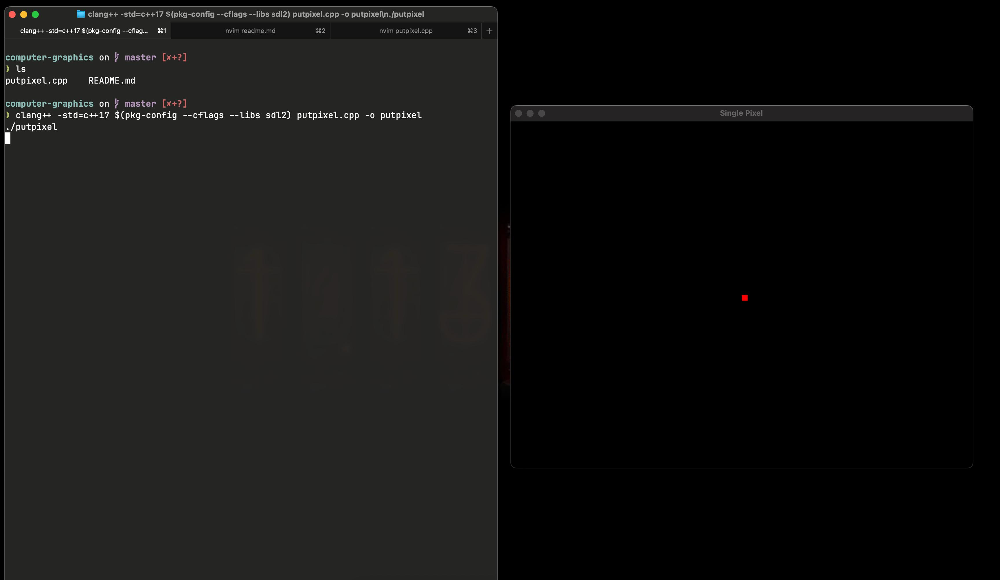

# SDL2 PutPixel (macOS)

A tiny C++ program using **SDL2** on **macOS** that opens an 800×600 window and draws a single red pixel (10×10 square) at the center.

## Screenshot
<p align="center">
  
</p>

## Installation & Compilation

### macOS
```sh
brew install sdl2 pkg-config
clang++ -std=c++17 $(pkg-config --cflags --libs sdl2) putpixel.cpp -o putpixel
./putpixel
```

### Linux (Ubuntu/Debian)
```sh
sudo apt update
sudo apt install libsdl2-dev pkg-config
g++ -std=c++17 $(pkg-config --cflags --libs sdl2) putpixel.cpp -o putpixel
./putpixel
```

### Windows (with MSYS2/MinGW)
```sh
pacman -S mingw-w64-x86_64-SDL2 mingw-w64-x86_64-pkg-config
g++ -std=c++17 $(pkg-config --cflags --libs sdl2) putpixel.cpp -o putpixel.exe
./putpixel.exe
```

### Windows (Visual Studio)
1. Download SDL2 development libraries from [libsdl.org](https://www.libsdl.org/download-2.0.php)
2. Extract and configure include/lib paths in Visual Studio
3. Link against SDL2.lib and SDL2main.lib

## Alternative: Using Make
```sh
make
./putpixel
```

## What it does
- Opens an 800×600 black window
- Draws a single red pixel (10×10 square for visibility) at coordinates (400, 300)
- Continues running until you close the window

## Requirements
- SDL2 library
- C++ compiler (Clang++, GCC, or MSVC)
- pkg-config (for easier compilation)
